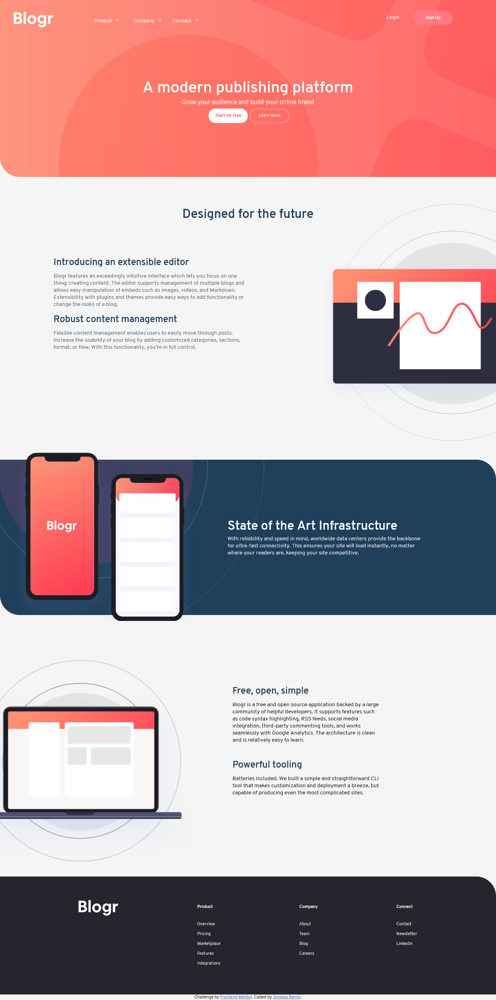
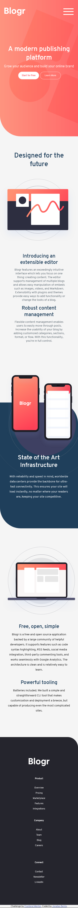

# Frontend Mentor - Blogr landing page solution

This is a solution to the [Blogr landing page challenge on Frontend Mentor](https://www.frontendmentor.io/challenges/blogr-landing-page-EX2RLAApP). Frontend Mentor challenges help you improve your coding skills by building realistic projects. 

## Table of contents

- [Overview](#overview)
  - [The challenge](#the-challenge)
  - [Screenshot](#screenshot)
  - [Links](#links)
- [My process](#my-process)
  - [Built with](#built-with)
  - [What I learned](#what-i-learned)
  - [Continued development](#continued-development)
  - [Useful resources](#useful-resources)
- [Author](#author)
- [Acknowledgments](#acknowledgments)

**Note: Delete this note and update the table of contents based on what sections you keep.**

## Overview

The challenge consists in building out this landing page and get it looking as close to the design as possible.
=======

My task was to build out the project to the designs inside the `/design` folder. There were both a mobile and a desktop version of the design. 

The designs were in JPG static format. Using JPGs will mean that I needed to use my best judgment for styles such as `font-size`, `padding` and `margin`.

### The challenge

You will be able to:

- View the optimal layout for the site depending on their device's screen size
- See hover states for all interactive elements on the page

### Screenshot





## My process

### Built with

- Semantic HTML5 markup
- CSS custom properties
- Flexbox
- Javascript


### What I learned

Something that was amazing in the process of building this landing page could be said of the styling bakground. Inserting gradient into the same background of an image, and customizing the location was for me a good thing to keep in my mind for next projects.

To see how you can add code snippets, see below:

```html
<h1>Some HTML code I'm proud of</h1>
```
```css
.proud-of-this-css {
  color: papayawhip;
}
```
```js
const proudOfThisFunc = () => {
  console.log('🎉')
}

### Continued development

Use this section to outline areas that you want to continue focusing on in future projects. These could be concepts you're still not completely comfortable with or techniques you found useful that you want to refine and perfect.


## Author

- Website - [Add your name here](https://www.your-site.com)
- Frontend Mentor - [@jonatasbento](https://www.frontendmentor.io/profile/yourusername)
- Linkedin [jonatas-bento] (linkedin.com/in/jonatas-bento)


## Acknowledgments

I would like to say thanks to my two teachers Leandro Leite and Patrick Reis. They have been encouraging me to move forward providing almost everything I need to go ahead! Thank you guys!
